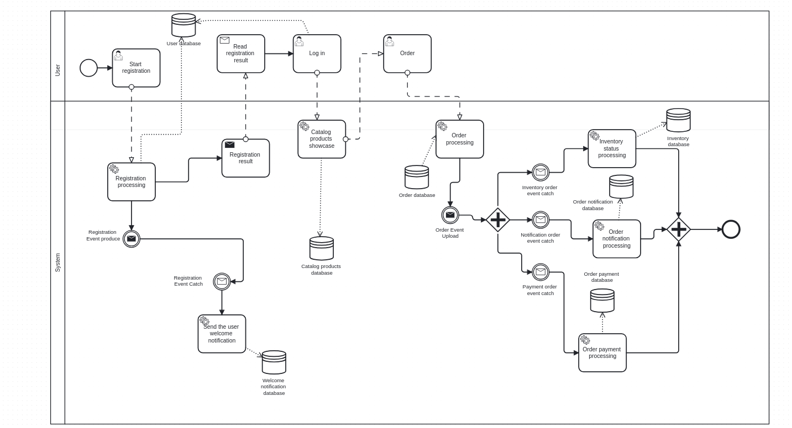
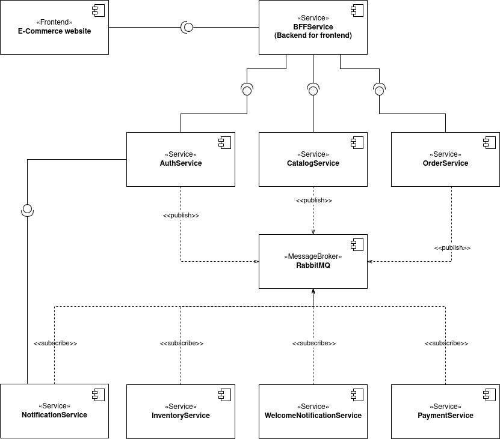

# E-Commerce Microservices Platform

---

## Abstract

This project presents a comprehensive, cloud-native e-commerce platform built on a **microservices architecture**. It demonstrates a modern approach to developing scalable, resilient, and maintainable distributed systems. The platform incorporates essential e-commerce functionalities such, as **user authentication**, **product catalog management**, **order processing**, **inventory control**, and **notifications**.

Computero-shop is my implementation of cloud-native e-commerce platform build on **microservices architecture**. I wanted to make it scalable and maintanable.

The platform itself incorporates such functionalities as **user authentication, product catalog management, order and payment processing and also notification system via simple smtp.**

My future plans include implementing such features as SSO, inventory control, review system and data gathering and showcasing it in admin panel.

The architecture supports both **local development** using Docker Compose and **cloud deployment on AWS** using Terraform for Infrastructure as Code (IaC), showcasing a complete development and deployment workflow.

Here's little flow on what functionalities we cover:

---

## Architecture

The system consists of several independent microservices, each with its specific responsibility and dedicated database, this model is called **database-per-service**. This design promotes **loose coupling** and allows services to be developed, deployed, and scaled independently.

### Architectural Diagram

Below you can find simplified diagram that shows general relations between services.

### Core Components

* **NGINX (API Gateway)**: Serves as the single entry point for all incoming client requests. It handles **request routing** to the appropriate service, **load balancing**, and **SSL termination**. As configured in `nginx.conf`, all API traffic (`/api/*`) is initially routed to the BFF Service.

* **BFF (Backend for Frontend) Service**: This service **aggregates data** from multiple microservices and formats it for a client, currently i only have web application, but of course there's possiblility to use this API with, for example, mobile application.
My vision of this service is to handle communication with our inner network of microservices via `FeignClient` exposing to a client only one, **normalized API**.
 
* **Microservices**:
    * **Auth Service**: Manages user registration, login, and authentication using JWTs.
    * **Catalog Service**: Responsible for all product-related data, including creation, retrieval, filtering, and management.
    * **Order Service**: Handles the creation and management of customer orders. It communicates asynchronously with other services after an order is placed.
    * **Inventory Service**: Tracks product stock levels, likely consuming events from the Order Service to decrement stock.
    * **Payment Service**: Processes payments for orders.
    * **Notification & WelcomeNotification Services**: Handle asynchronous tasks like sending order confirmation or welcome emails to users.

Please note also that NotificationService still uses synchronous HTTP requests to fetch user's data. I decided to design it this way to minimalize weight of asynchronously published events, so those asynchronous events work mostly as triggers transporting only the most necessary data, while dealing with extra data is handled via traditional ways.

### Communication Patterns

* **Synchronous (REST)**: The BFF service communicates with core services like Auth, Catalog, and Order using synchronous RESTful API calls. This is implemented using Spring Cloud's **OpenFeign**, as shown in `BFFService`.

* **Asynchronous (Messaging)**: For operations that don't require an immediate response, services communicate via a **message broker**. The project uses **RabbitMQ** for this purpose. For example, when an order is created, the `OrderService` publishes an event, which is then consumed by the `InventoryService` and `NotificationService` to perform their respective tasks. This decouples the services and improves system resilience.

### Data Management

As I said before, the whole projects uses **database-per-service** pattern. Each microservice has its own dedicated **PostgreSQL** database, ensuring data isolation and independent evolution of service schemas. Our system requires databases for each microservice to work correctly. Locally I developed a simple script that ensures each database is correctly created. While deplying in the cloud i used Amazon RDS, not sure how it works with different options.

---

## Deployment

The platform is designed for flexible deployment, supporting both local development and cloud environments.

### Local Development

The entire platform can be easily spun up locally using `docker-compose.yml`. This file defines all the services, their dependencies, networking, and configuration, making it straightforward for developers to get started.

### Cloud (AWS)

#### For now i don't want to publish this part of code, because i still am working on bash scripts and terraform files.

The project is specifically designed for cloud deployment on AWS.

* **Infrastructure as Code**: `AWS/main.tf` uses **Terraform** to provision all necessary cloud resources, including a **VPC**, an **AWS RDS instance for PostgreSQL**, and an **Amazon MQ instance for RabbitMQ**.
* **Container Registry**: The `docker-deploy.sh` script builds Docker images for each service and pushes them to **AWS ECR (Elastic Container Registry)**.
* **Deployment Scripts**: The `docker-setup.sh` and `docker-deploy.sh` scripts automate the process of running the service containers, injecting the correct database and message broker connection strings from the Terraform outputs.

---

## Technologies Used

| Category                | Technology                                                                     |
| :---------------------- | :----------------------------------------------------------------------------- |
| **Backend** | Java, Spring Boot, Spring Cloud (OpenFeign)                                    |
| **Database** | PostgreSQL                                                                     |
| **Messaging** | RabbitMQ                                                                       |
| **API Gateway** | NGINX                                                                          |
| **Containerization** | Docker, Docker Compose                                                         |
| **Cloud Provider** | AWS (Amazon Web Services)                                                      |
| &nbsp;&nbsp;&nbsp;└ Compute/Containers | AWS ECR (for Docker images), likely deployed to ECS or EKS (not specified) |
| &nbsp;&nbsp;&nbsp;└ Database          | AWS RDS for PostgreSQL                                                     |
| &nbsp;&nbsp;&nbsp;└ Messaging         | Amazon MQ for RabbitMQ                                                     |
| &nbsp;&nbsp;&nbsp;└ Networking        | AWS VPC                                                                    |
| **Infrastructure as Code** | Terraform                                                                      |
| **Build & CI/CD** | Shell Scripting (bash)                                                         |

---

## Microservice Descriptions

This project is composed of eight distinct microservices, each designed to handle a specific business capability. This separation of concerns is a core principle of microservices architecture.

### 1. Auth Service (`AuthService`)

* **Purpose**: This service is the central authority for user management and security. It handles user registration, login (authentication), and the creation of **JSON Web Tokens (JWTs)** used to secure other parts of the application. Upon successful user registration, it publishes a `UserRegisteredEvent` to a RabbitMQ topic, allowing other services to react to new users.
* **Key Dependencies**:
    * `spring-boot-starter-security`: Core Spring framework for authentication and access control.
    * `spring-boot-starter-data-jpa`: For data persistence using JPA and Hibernate.
    * `spring-boot-starter-amqp`: For integrating with RabbitMQ to publish events.
    * `jjwt (Java JWT)`: A library for creating and verifying JSON Web Tokens.
    * `postgresql`: JDBC driver for the PostgreSQL database.

### 2. Catalog Service (`CatalogService`)

* **Purpose**: This service manages all product-related information. It acts as the source of truth for the product catalog, handling operations like creating, reading, updating, and deleting products (**CRUD**). It also provides a powerful filtering and pagination API to allow clients to efficiently search and browse products.
* **Key Dependencies**:
    * `spring-boot-starter-web`: For exposing RESTful API endpoints.
    * `spring-boot-starter-data-jpa`: For managing product data in the database.
    * `postgresql`: JDBC driver for the PostgreSQL database.
    * `org.projectlombok:lombok`: To reduce boilerplate code (e.g., getters, setters, constructors).

### 3. Order Service (`OrderService`)

* **Purpose**: This service is responsible for the entire order lifecycle. It handles the creation of new orders from a customer's cart, retrieves order history, and manages order statuses. When an order is successfully placed, it publishes an `OrderCreatedEvent` to RabbitMQ. This event-driven approach decouples it from services like inventory and notifications, which can then process the order asynchronously.
* **Key Dependencies**:
    * `spring-boot-starter-web`: For its REST API.
    * `spring-boot-starter-data-jpa`: For persisting order information.
    * `spring-boot-starter-amqp`: For publishing order events to RabbitMQ.
    * `postgresql`: JDBC driver for its dedicated PostgreSQL database.

### 4. Inventory Service (`InventoryService`)

* **Purpose**: This service tracks the stock levels of all products. It operates asynchronously by listening for the `OrderCreatedEvent` on a RabbitMQ queue. When it receives an event, it decrements the stock for the items in the order, ensuring that the inventory is always up-to-date without blocking the initial order creation process.
* **Key Dependencies**:
    * `spring-boot-starter-amqp`: To consume events from RabbitMQ.
    * `spring-boot-starter-data-jpa`: For managing inventory counts in its database.
    * `postgresql`: JDBC driver for PostgreSQL.
    * `spring-boot-starter-web`: To potentially expose endpoints for checking stock levels.

### 5. Notification Service (`NotificationService`)

* **Purpose**: This is a generic notification handler, focused on sending emails related to orders. It subscribes to the `OrderCreatedEvent` from RabbitMQ. Upon receiving a message, it sends an order confirmation email to the customer. It is designed to be a general-purpose service for various notification types.
* **Key Dependencies**:
    * `spring-boot-starter-amqp`: To consume events from RabbitMQ.
    * `spring-boot-starter-mail`: The core Spring library for email sending capabilities.
    * `spring-boot-starter-data-jpa`: For its own database needs (e.g., logging sent notifications).
    * `postgresql`: JDBC driver for PostgreSQL.

### 6. Welcome Notification Service (`WelcomeNotificationService`)

* **Purpose**: This is a highly specialized service that demonstrates a further breakdown of responsibilities. Its single purpose is to listen for the `UserRegisteredEvent` (published by the AuthService) and send a welcome email to the new user. This isolates the "welcome" logic from other notification types.
* **Key Dependencies**:
    * `spring-boot-starter-amqp`: To consume user registration events.
    * `spring-boot-starter-mail`: For sending the welcome email.
    * `postgresql`: JDBC driver for its dedicated PostgreSQL database.

### 7. Payment Service (`PaymentService`)

* **Purpose**: This service is responsible for handling all payment-related logic. In a real-world scenario, it would integrate with a third-party payment gateway (like Stripe or PayPal). It listens for an event indicating an order is ready for payment, processes the transaction, and then publishes a `PaymentSuccessful` or `PaymentFailed` event back to the system.
* **Key Dependencies**:
    * `spring-boot-starter-amqp`: For consuming and publishing payment-related events.
    * `spring-boot-starter-data-jpa`: To track the status of payments in its database.
    * `postgresql`: JDBC driver for PostgreSQL.
    * `spring-boot-starter-web`: To expose any necessary payment-related endpoints.

### 8. BFF Service (`BFFService`)

* **Purpose**: The **Backend-for-Frontend (BFF)** service acts as a facade and aggregator for the frontend application. It simplifies client-side development by providing a single, consolidated API. Instead of the frontend having to call multiple microservices, it makes one call to the BFF, which then orchestrates the necessary calls to downstream services (Auth, Catalog, Order, etc.) using declarative Feign clients.
* **Key Dependencies**:
    * `spring-cloud-starter-openfeign`: The key library that enables the creation of easy-to-use, declarative REST clients for communicating with other microservices.
    * `spring-boot-starter-web`: To expose its aggregated API to the frontend.
    * `jjwt (Java JWT)`: For decoding and validating JWTs from incoming frontend requests to ensure the user is authenticated before proceeding.

---

## Frontend Application

The frontend part of the platform is a modern, responsive web application built with **Next.js** and **React**. It provides a fast, server-rendered experience for users.

Currently i have pages such as:
- Sign In/Sign Out
- Main Landing Page
- Catalog Page
- Cart/Order/Payment Page
- Admin Panel
- Product Detail Page

### Stack

The frontend is built with a focus on developer experience, performance, and modern UI design.
| Category | Technology | Why & Where |
| :--- | :--- | :--- |
| **Framework** | Next.js (React) | For **Server-Side Rendering (SSR)** and **React Server Components (RSCs)**, ensuring a fast, SEO-friendly site. The entire app uses the App Router (`/app`). RSCs fetch data on pages like `product/[id]`, and `next/link` handles navigation. |
| **Language** | TypeScript | Enforces **type safety**, reducing runtime errors and improving code maintainability. Used project-wide for API models (`Product`, `Order`), component props, and state variables. |
| **Styling** | Tailwind CSS | Its **utility-first approach** allows for rapid UI development by composing classes directly in the markup. Styles all components. The design system is defined in `tailwind.config.ts`, and theming in `globals.css`. |
| **UI Components**| shadcn/ui | Provides accessible and **highly-customizable components** that are copied into the project, giving full control. Used for all core UI elements like `Button`, `Card`, `Input`, and `Tabs` across the application. |
| **State Mngmt.**| React Context API | A simple, **built-in solution** for managing global state like user auth and the shopping cart without external libraries.  Implemented via `AuthProvider` and `CartProvider` in the main layout, consumed by hooks like `useAuth` and `useCart`. |
| **Icons** | Lucide React |  A lightweight, **tree-shakable** icon library for a clean and consistent UI without increasing bundle size.  Used for all icons, such as `ShoppingCart`, `ArrowRight`, and status indicators throughout the app. |
### Key functions and structure

My application is structured using the **Next.js App Router**

* **Component-Based Architecture**: The UI is broken down into reusable components (e.g., `Navbar`, `ProductGrid`, `CartSummary`) located in the `/components` directory. Of course this is a standard technique that helps with maintainability and reusability of code.
* **Centralized API Logic**: All interactions with the backend BFF service are encapsulated in functions within the `/lib` directory (e.g., `fetch-products.ts`, `user-auth.ts`, `order-api.ts`). This separates data-fetching logic from the UI components.
* **Global State Management**:
    * **`AuthContext`**: Manages the user's authentication state, including the JWT token and user profile information, making it available throughout the application.
    * **`CartContext`**: Manages the state of the shopping cart, allowing users to add, remove, and view items seamlessly across different pages.
* **Dynamic and Static Routing**: The application uses dynamic routes for product detail pages (e.g., `/catalog/product/[id]`) and static routes for pages like the main catalog, sign-in, and sign-up.
* **Styling and Theming**: The application uses **`tailwind-merge`** and **`clsx`** for intelligent class name management and **`next-themes`** to support both light and dark modes, with styles defined in `globals.css`.

This setup creates a robust and scalable foundation for the e-commerce user interface, ensuring a smooth and pleasant shopping experience.